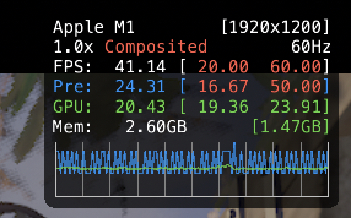

# MetalHUDEnabler

MetalHUDEnabler allows for permanently enabling the new Metal 3 performance HUD for any Metal-enabled application on macOS Ventura.

# Usage

Using MetalHUDEnabler is as simple as executing ``./MetalHUDEnabler [path to application] [enable/disable]`` then launching the target app normally from the dock or wherever else.

For example:  ``./MetalHUDEnabler /Applications/CrossOver.app enable`` would enable the Metal 3 performance HUD for the CrossOver application (and most games launched from it as a result).

# Anything else?

Sorta. This is a hacky way of achieving this and I'm sure there is some better method out there.

**May or may not work with App Store apps** (tried with Resident Evil Village, app wouldn't open. YMMV. 

If you are going to try this with an App Store app, you may need to run with ``sudo``.

**If any of the apps you're using with MetalHUDEnabler need to be updated, make sure you use MetalHUDEnabler to disable the performance HUD first before you actually update them.**

I am not responsible for any damages.
