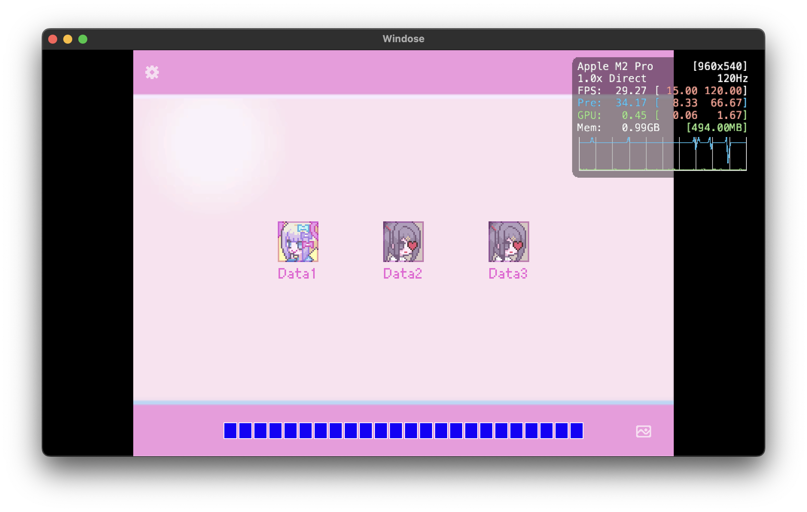
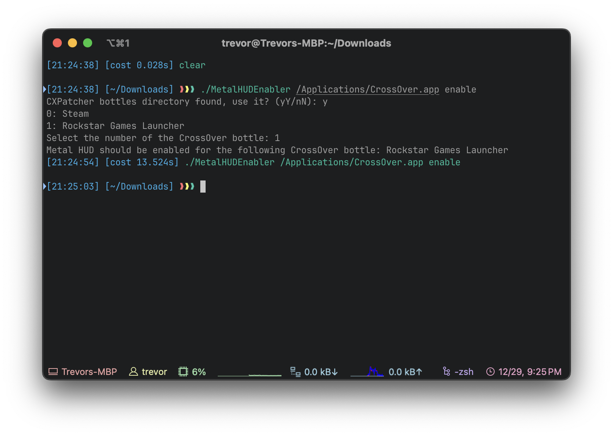
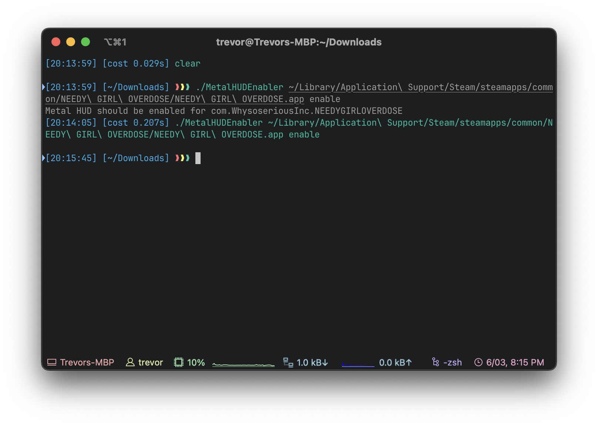

# MetalHUDEnabler

MetalHUDEnabler allows for permanently enabling the new Metal 3 performance HUD on a per-application basis for any application that uses the Metal framework on macOS Ventura and later.

# Usage

Using MetalHUDEnabler is as easy as executing ``./MetalHUDEnabler [path to application] [enable/disable]`` then simply launching the application through whatever means you normally would.

``./MetalHUDEnabler </path/to/CrossOver.app> enable`` will launch a menu that will allow the user to enable the Metal 3 performance HUD on a per-bottle basis by setting the ``MTL_HUD_ENABLED`` environment variable to ``1`` in the chosen bottle's ``cxbottle.conf``. In the below screenshot, I am using my CrossOver bottle for the Rockstar Games Launcher as an example.

``./MetalHUDEnabler </path/to/other.app> enable`` will instead just directly enable the Metal 3 performance HUD by writing a boolean ``MetalForceHudEnabled = true`` to that specific application's defaults. In the below screenshot, I am using a macOS-native game *NEEDY GIRL OVERDOSE* as an example.

Disabling the Metal 3 performance HUD works the exact same way as enabling it, just replace ``enable`` in the previous command(s) with ``disable``. 
- For CrossOver bottles, it will remove the ``MTL_HUD_ENABLED`` environment variable from the bottle's ``cxbottle.conf``
- For any other Metal-enabled application, it will delete the ``MetalForceHudEnabled`` boolean from that application's defaults.

# Anything else?
This should **theoretically** work with any application that uses Metal. Please let me know of any issues.

That being said, I am not responsible for any damages and you are running this application at your own risk *although I don't see much of a possibility for things to go wrong here*. Have fun.